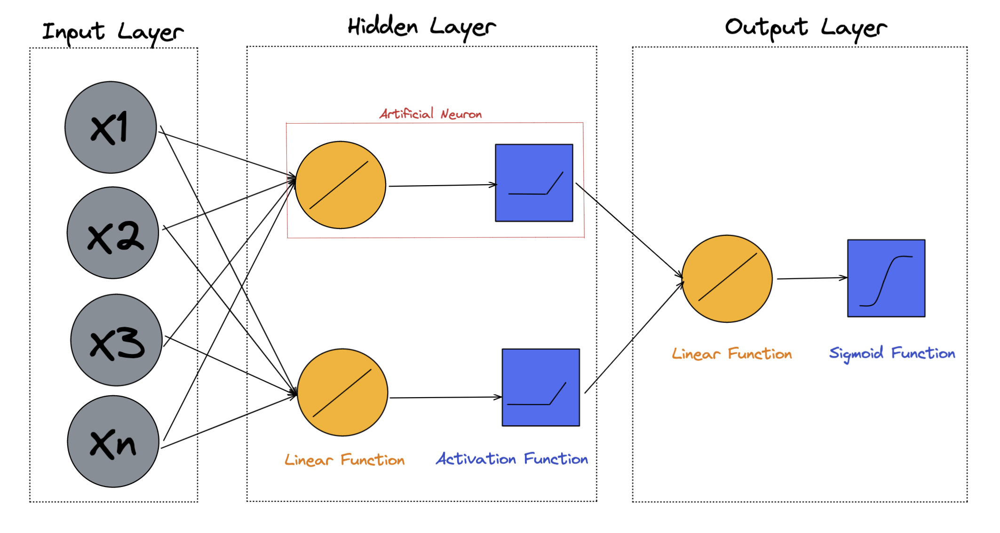

# Building a Neural Network with PyTorch
## _Machine Learning from Disaster Dataset_
### DATA: https://www.kaggle.com/competitions/titanic/overview

## What is a neural network (nn) ?
- A neural network is a method in artificial intelligence that teaches computers to process data in a way that is inspired by the human brain. 
- It is a type of machine learning process, called deep learning, that uses interconnected nodes or neurons in a layered structure that resembles the human brain. 
- It creates an adaptive system that computers use to learn from their mistakes and improve continuously.

## What are the building blocks of a nn in PyTorch?
- Tensors: A tensor is a matrix-like data structure that is used across deep learning frameworks. Tensor operations are fundamental to PyTorch, and are used for all data.
- Dataset class constructor: The dataset constructor at a minumum, has to have two methods created. __len__ , and __getitem__ to apply to the tensors in the dataset. 
    it is also commonly where input dataframes are converted to tensors, and normalization transforms are applied.
- Input layer: The input layer is said to be x-dimensional, where x is the number of explanatory variables or features.
- Hidden Layer(s): The hidden layers are constructed of artificial neurons, which are sequential applications of linear functions which are passed through activation functions.
- Output Layer: In the case of binary classification, the output layer consists of a consolidating linear function, which is passed through a sigmoid function to output a probability for class. In the binary case, the output is of dimension 1. In multi-class classification, the output is n-dimensional, where n is the number of possible class.
- Loss Function: The loss function is the criterion on which the network measures success. For example, in simple linear regression, we try to minimize mean square error. There are numerous loss funcitons that can be used for different applications. Binary cross-entropy loss is a commonly used for single-class prediction. Cross-entropy loss can be extended for use in multi-class classification.
- Optimizer: The optimizer is a function or algorithm that updates the network parameters at each epoch, and is integral to the learning process. The weights of the parameters are increased or decreased progressively in attempt to reduce loss on the next pass.

## When does learning become "deep"?
> The distinction between learning 
> and deep learning is in the number of 
> hidden layers used. If a model uses
> two or more hidden layers, we refer
> to the model as a deep learning model.

## Problem Description and Data
